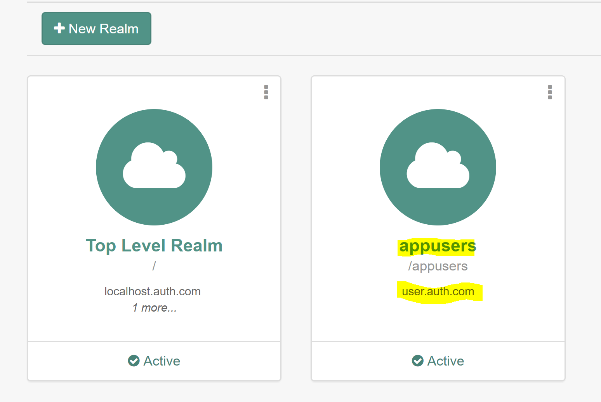
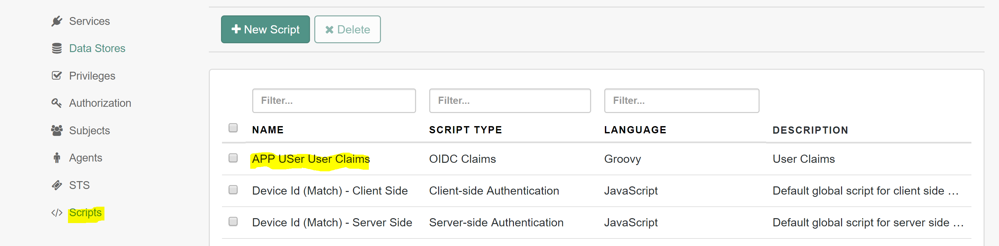
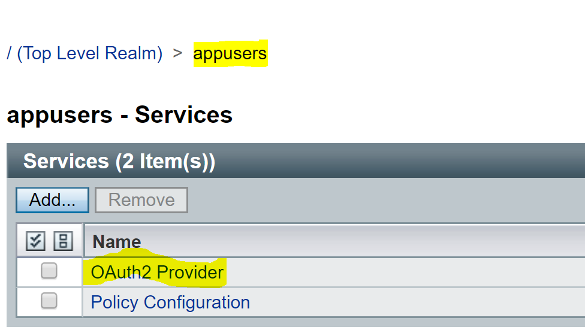
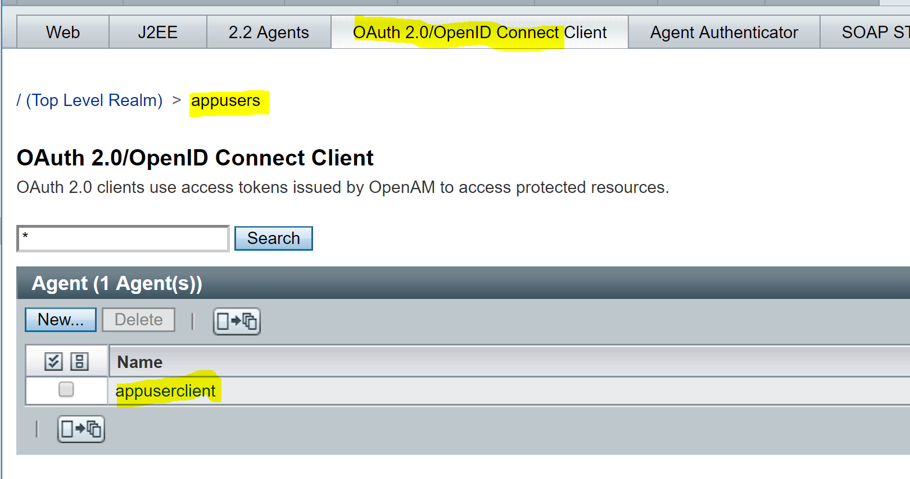
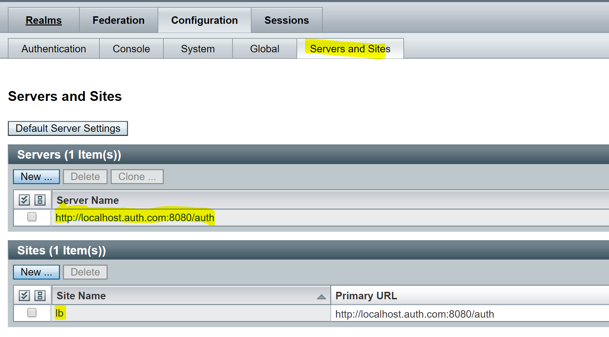
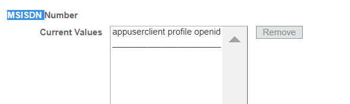

# Introduction
This is a sample app to show case the OpenAM capabilities for OAuth2/OpenID Connect.


# Prerequiste

* Tomcat7
* Node JS and NPM package manger

# Note
* This readme is based on Linux OS

# Use case

* When a user is trying to access the dashboard(protected resource) of a web app,if user is not authenticated ,user will be challenged(by openam) for the user name and password.
* Once user is successfully authenticated, application will be navigated to the Dashboard
* Dashboard shows all info related to the OAuth2 flow. Following info will be shown on the dashboard
  * Response of Authorization code request
  * Request/Response of Access token call
  * Request/Response of UserInfo endpoint call
  * Request/Response of Tokeninfo endpoint call
  * ID Token decoded info


# OpenAM Setup
* Download or copy this source a folder,say `/opt/iam/stage` - `$STAGE`
* Modify the `/etc/hosts` file and add following entries.
  * 127.0.0.1       localhost.auth.com
  * 127.0.0.1       user.auth.com
* Copy the OpenAM war file to the TOMCAT webapps folder.
  * Obatin the OpenAm 13 war from backstage.forgerock.com ,rename it to auth.war and copy it over to the webapps folder of TOMCAT server`
* Start the TOMCAT server.
  * Assumption : TOMCAT is running on port `8080`,if it is running in a different port config need to be updated accordingly.
* Open a command prompt and cd into `$STAGE/openam` folder
* Run `./install.sh`
  * The install script will take care of configuring OpenAM from scratch.
  * Below steps are informational, you don't need to run these steps as the install.sh will automatically run all these steps. Here are the steps involved in the install scripts.
  * `STEP -1` - Steps up the base configurations like setting up the config folder and datastore configuration
    * OpenAM config folder will be created in the path - `/opt/iam/auth/`
  * `STEP -2` - This step will configure SSOADM tool.
  * `STEP -3` - next step is to create a new realm called - `appusers`

    ```sh
    $SSO_ADM/auth/bin/ssoadm create-realm \
    --adminid amadmin \
    --password-file $passFile \
    --realm appusers
    ```

  * `STEP -4` - This would DNS alias to the `appusers` realm, URL with host name as -`user.auth.com` will use the `appusers` realm

    ```sh
    $SSO_ADM/auth/bin/ssoadm set-realm-attrs \
    --adminid amadmin \
    --password-file $passFile \
    --realm /appusers \
    --servicename sunIdentityRepositoryService \
    --attributevalues sunOrganizationAliases=user.auth.com
    ```


  * `STEP -5` - Updates the FQDN Map

    ```sh
    $SSO_ADM/auth/bin/ssoadm update-server-cfg \
    --adminid amadmin \
    --password-file $passFile \
    --servername default \
    --datafile $STAGE/conf/fqdn.conf

    ```
  * `STEP -6` - This step would create a new OIDC groovy script adapter .This script is same as the out of the box OIDC script. This is just to show case that we could customize the OIDC script for any custom OIDC scopes. For this sample app we are using profile and openid connect scopes.

    ```sh
    $SSO_ADM/auth/bin/ssoadm create-sub-cfg \
    --realm /appusers \
    --servicename ScriptingService \
    --subconfigname scriptConfigurations/scriptConfiguration \
    --subconfigid userClaims \
    --adminid amadmin \
    --password-file $passFile \
    --attributevalues "script-file= $STAGE/conf/claims.groovy" \
    --datafile $STAGE/conf/claims.conf
    ```


  * `STEP -7` - This will create `OAuth2 Provider` service for the `appusers` realm.

    ```sh
    $SSO_ADM/auth/bin/ssoadm add-svc-realm \
    --adminid amadmin \
    --password-file $passFile \
    --servicename OAuth2Provider \
    --realm /appusers \
    --datafile $STAGE/conf/oauth-provider.conf

    ```  

    

  * `STEP -8` - Next step is to configure the OIDC client - `appuserclient`.This OIDC client is configured for the scopes openid and profile.

    ```sh
    $SSO_ADM/auth/bin/ssoadm create-agent \
    --adminid amadmin \
    --password-file $passFile \
    --realm /appusers \
    --agenttype OAuth2Client \
    --agentname appuserclient \
    --datafile $STAGE/conf/oauth-client.conf
    ```  



  * `STEP -9` - Create new site configuration to allow the `user.auth.com` URL

    ```sh
    $SSO_ADM/auth/bin/ssoadm create-site \
    --adminid amadmin \
    --password-file $passFile \
    --sitename lb \
    --siteurl http://localhost.auth.com:8080/auth \
    --secondaryurls http://user.auth.com:8080/auth
    ```



  | Item          	| Value                          	|
  |---------------	|--------------------------------	|
  | SERVER URL    	| http://localhost.auth.com:8080 	|
  | OPENAM CONTEXT PATH    	| /auth 	|
  | CONFIG DIR    	| /opt/iam/auth/                 	|
  | ADMIN ID/PWD     	| amadmin/Test@1234                      	|
  | COOKIE DOMAIN 	| .auth.com                      	|
  | REALM 	        | appusers                      	|
  | OIDC CLIENT     | appuserclient                  	|
  | OIDC SCOPES     | openid profile                 	|
  | TEST USERID/PSwrd     | demo/changeit                 	|


* After the completion of installation script, we need to make a config change through the Admin console.
  * In Admin console navigate to the subjects tab in the appusers realm.
    `Realm->appusers->subjects`
  * By default there will be demo user, modify the demo user.
      * Complete the missing basic infos like last name, email etc..
      * Scroll down and find `MSISDN Number` and add the below string a a new value.
          `appuserclient profile openid`          
        `sunidentityMSISDNNumber` is used as the auto consent field in the OAuth2 provider service.



# Client

Note : The client app need to be installed on localhost and port 9090 so that we don't need to change any openam configuration and web code.

  * Web application Setup
    * Open a command shell and cd int to `$STAGE/ui` folder
    * Install the npm htpp-server
      `npm install http-server -g`
    * Run the below command to start the web application.
      `http-server -c-1 -p 9090`
    * Open chrome browser and open the url - `http://localhost:9090/index.html`
    * Click on the button to navigate to Dashboard. Dashboard is a protected resource,OpenAM will challenge for the user credentials.
    * Login with the demo user.
      `demo/changeit`
